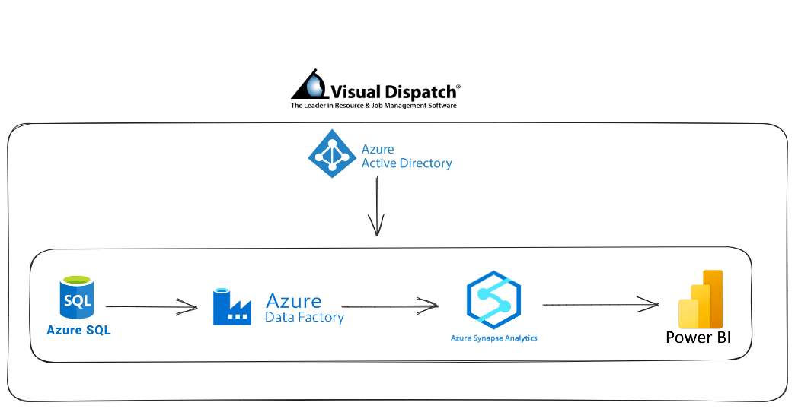

# :technologist: Azure Synapse Analytics Pipeline :technologist:

**`Project Architecture`**

**`Client Feedback`**

**`Project Title:`**
- Data Pipeline from Azure SQL to Azure Synapse Analytics with Power BI Dashboard

**`Project Description:`**

- This GitHub repository documents a secure and efficient data pipeline solution designed and implemented as a freelance project for VisualDispatch, a prominent American logistics company. The primary objective was to develop a robust pipeline that transforms data seamlessly from Azure SQL to Azure Synapse Analytics while ensuring the highest standards of security and data integrity.

# Key Features

## Azure SQL Database

Azure SQL hosts the company's database, containing over 6 million rows of data, including client information, workflow optimization data, and productivity metrics. This production database should not be impacted by transactions, view creations, or new table additions. To utilize the database data for analytical purposes, the plan is to transfer it to Azure Synapse using Azure Data Factory.

## Azure Data Factory Tasks

Azure Data Factory will be employed to:

- Develop a mapping data flow, involving the creation of two source activities for specific tables in the database, a join activity, a select activity, a derived column activity, and finally, a sink activity. The objective is to generate a fact table within the same mapping data flow canvas.

- Form three dimension tables by joining other tables in the database, establishing surrogate keys, and implementing a cache sink.

## Azure Synapse Analytics Integration

In Azure Synapse Analytics, the following steps will be taken:

- Construct the schema for the fact table in a dedicated SQL pool within Synapse, utilizing hash distribution.

- Design the schema for dimension tables within the same pool, utilizing replicated tables distribution.

## Azure Entra ID (Ex, Active Directory)

For Azure Entra ID:

- Generate a new user and grant them access to the created pool in Synapse, enabling them to leverage the data in Power BI.

## Power BI Integration

In Power BI, the process involves:

- Connecting the Azure Synapse pool to Power BI to visualize the data and create reports.

## Client Engagement
- The project was executed remotely through TeamViewer, allowing real-time collaboration with VisualDispatch's CEO. Detailed explanations and training were provided to ensure the VisualDispatch team could use and maintain the solution independently in the future.

## Deliverable
- A well-documented data pipeline architecture.
- Integration of a Power BI dashboard for data visualization.
- Secure role-based access control using Azure Entra ID ( Ex-Azure Active Directory ) .

**`Contributors::`**
 - HAJJARI Mohammed

